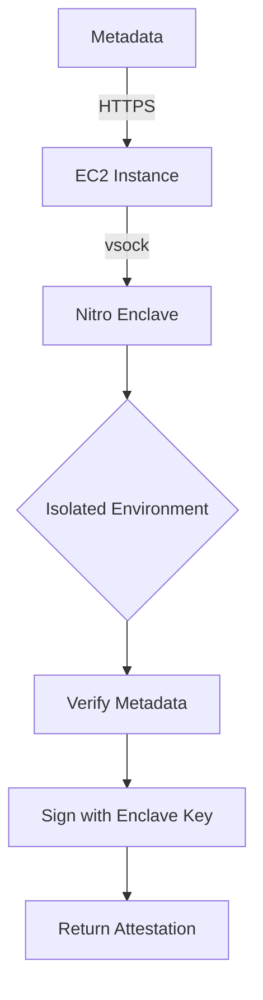

<p align="center">
  
</p>

# SealTrust Nautilus Enclave

Trusted Execution Environment (TEE) service for dataset metadata verification.

<p align="center">
  
  &nbsp;&nbsp;
  
  &nbsp;&nbsp;
  
</p>

---

## The Problem

Verifying dataset metadata requires trust. A centralized server could:
- Sign fake metadata
- Be compromised by attackers
- Be coerced by administrators

## The Solution

Run verification in AWS Nitro Enclave. Hardware-isolated execution that even AWS cannot access.



---

## How It Works

1. Frontend sends dataset metadata to Nautilus
2. Enclave validates all required fields
3. Signs the metadata with Ed25519 ephemeral key
4. Returns signature for on-chain verification

<details>
<summary>Verification Fields</summary>

```rust
pub struct DatasetVerification {
    pub dataset_id: Vec<u8>,
    pub name: Vec<u8>,
    pub description: Vec<u8>,
    pub format: Vec<u8>,
    pub size: u64,
    pub original_hash: Vec<u8>,    // Hash of UNENCRYPTED file
    pub walrus_blob_id: Vec<u8>,
    pub seal_policy_id: Vec<u8>,
    pub timestamp: u64,
    pub uploader: Vec<u8>,
}
```

</details>

---

## Quick Start

### Local Development

```bash
# Run server
cargo run --release

# Health check
curl http://localhost:3000/health_check

# Test verification
curl -X POST http://localhost:3000/verify_metadata \
  -H "Content-Type: application/json" \
  -d '{"metadata": {...}}'
```

### Production (AWS Nitro)

```bash
# Build enclave image
make build

# Run enclave
make run

# Check status
make status
```

---

## Makefile Commands

| Command | Description |
|---------|-------------|
| `make build` | Build .eif enclave image |
| `make run` | Run enclave (production) |
| `make run-debug` | Run with debug console |
| `make clean` | Remove build artifacts |
| `make status` | Check enclave status |
| `make pcrs` | View PCR measurements |

---

## API Endpoints

| Endpoint | Method | Description |
|----------|--------|-------------|
| `/health_check` | GET | Returns "OK" if running |
| `/verify_metadata` | POST | Verify and sign metadata |
| `/attestation` | GET | Get enclave attestation document |

<details>
<summary>verify_metadata Request</summary>

```json
{
  "metadata": {
    "dataset_id": [1, 2, 3],
    "name": [116, 101, 115, 116],
    "description": [100, 101, 115, 99],
    "format": [67, 83, 86],
    "size": 1024,
    "original_hash": [0, 1, 2, ...],
    "walrus_blob_id": [98, 108, 111, 98],
    "seal_policy_id": [112, 111, 108],
    "timestamp": 1700000000000,
    "uploader": [117, 115, 101, 114]
  }
}
```

</details>

<details>
<summary>verify_metadata Response</summary>

```json
{
  "data": {
    "intent_scope": 0,
    "timestamp_ms": 1700000000000,
    "data": { ... }
  },
  "signature": "0xabc123..."
}
```

</details>

---

## How We Use Nautilus

<details>
<summary>Frontend Integration</summary>

```typescript
const response = await fetch(`${NAUTILUS_URL}/verify_metadata`, {
  method: 'POST',
  headers: { 'Content-Type': 'application/json' },
  body: JSON.stringify({ metadata }),
});

const { signature } = await response.json();
// signature is hex-encoded Ed25519 signature
```

</details>

<details>
<summary>Move Contract Verification</summary>

```move
let is_valid = enclave::verify_signature<T, DatasetVerification>(
    enclave,
    DATASET_INTENT,
    timestamp_ms,
    verification_data,
    tee_signature
);
assert!(is_valid, EInvalidSignature);
```

</details>

---

## AWS Deployment

### Prerequisites

- EC2 instance with Nitro Enclaves enabled (m5.xlarge or similar)
- Docker installed
- AWS Nitro CLI installed

### Steps

```bash
# 1. SSH to EC2
ssh -i key.pem ec2-user@instance-ip

# 2. Clone repo
git clone https://github.com/Seal-Trust/sealtrust-enclave
cd sealtrust-enclave

# 3. Build enclave
make build

# 4. Run
make run
```

<details>
<summary>Systemd Service Setup</summary>

```bash
# Create service file
sudo nano /etc/systemd/system/nautilus.service
```

```ini
[Unit]
Description=SealTrust Nautilus Enclave
After=network.target

[Service]
Type=forking
ExecStart=/usr/bin/nitro-cli run-enclave --eif-path /home/ec2-user/sealtrust-enclave/out/nitro.eif --cpu-count 2 --memory 512M
ExecStop=/usr/bin/nitro-cli terminate-enclave --all
Restart=on-failure

[Install]
WantedBy=multi-user.target
```

```bash
sudo systemctl enable nautilus
sudo systemctl start nautilus
```

</details>

---

## Production Deployment (Sui Testnet)

| Component | Value |
|-----------|-------|
| **Enclave URL** | [`https://nautilus.sealtrust.app/health`](https://nautilus.sealtrust.app/health) |
| **Instance Type** | `m5a.xlarge` |
| **Region** | `ap-northeast-1` |
| **CPU** | 2 cores dedicated |
| **Memory** | 1024 MiB |

### On-Chain Objects

| Object | ID |
|--------|-----|
| **Enclave** | `0x611b83f2b4d97471a6c164877ff23a2f0570806baf3d9380d1f11433a2b685ec` |
| **EnclaveConfig** | `0x55d6a15a5e8822b39f76dc53031d83beddc1e5b0e3ef804b82e8d4bfe4fbdc32` |
| **SealTrust Package** | `0xcdc25c90e328f2905c97c01e90424395dd7b10e67769fc8f4ae62b87f1e63e4e` |

### PCR Measurements

```
PCR0: b13c459767dfa980fc070317cced783437b0198963564bd5f906a5b35f209f8104e1ddbc64ad0615842c6a243e0b6758
PCR1: b13c459767dfa980fc070317cced783437b0198963564bd5f906a5b35f209f8104e1ddbc64ad0615842c6a243e0b6758
PCR2: 21b9efbc184807662e966d34f390821309eeac6802309798826296bf3e8bec7c10edb30948c90ba67310f7b964fc500a
```

---

## File Structure

```
nautilus-app/
├── src/
│   ├── main.rs           # HTTP server (Axum)
│   ├── lib.rs            # Verification logic
│   └── common.rs         # Signing utilities
├── docker/
│   ├── Containerfile.aws # Nitro enclave build
│   └── Dockerfile.dev    # Local development
├── Makefile.aws          # Build commands
├── Cargo.toml
└── README.md
```

---

## Testing

```bash
# Run all tests
cargo test

# Run with output
cargo test -- --nocapture
```

Tests cover:
- BCS serialization consistency with Move
- Hash computation
- Intent message structure
- Request/response parsing

---

## Security

- Enclave key is ephemeral (regenerated on boot)
- PCR measurements verify code integrity
- vsock communication (no network inside enclave)
- Even AWS admins cannot access enclave memory

---

## Reference

- [Nautilus Documentation](https://docs.sui.io/concepts/cryptography/nautilus)
- [AWS Nitro Enclaves](https://docs.aws.amazon.com/enclaves/)
