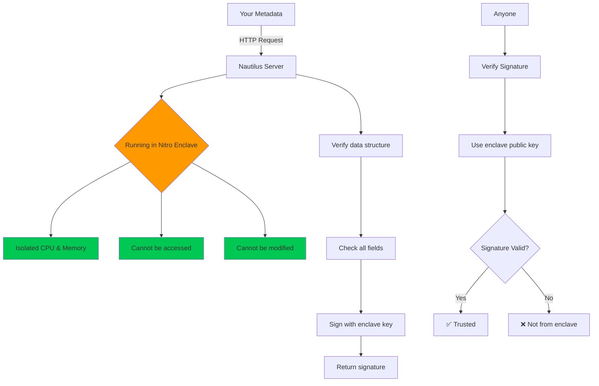
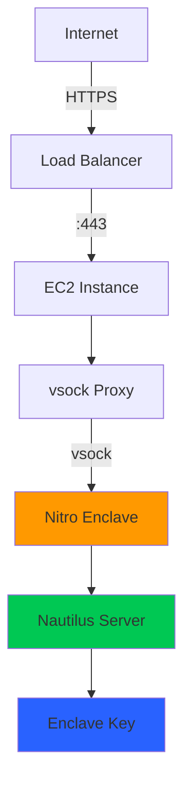

# Nautilus TEE Application

**Trusted Execution Environment for Dataset Metadata Verification**

This is the Nautilus server that runs inside AWS Nitro Enclaves to provide tamper-proof verification of dataset metadata.

---

## What Is This?

Think of Nautilus as a secure referee that nobody can bribe or influence:

- Runs inside special secure hardware (AWS Nitro Enclave)
- Even AWS administrators cannot access or modify it
- Provides cryptographic proof that verification happened correctly
- Signs metadata with a key that only the enclave knows

---

## How It Works



---

## What Gets Verified

When you register a dataset, Nautilus checks:

```rust
pub struct DatasetVerification {
    pub dataset_id: Vec<u8>,      // Unique ID
    pub name: Vec<u8>,            // Dataset name
    pub description: Vec<u8>,     // Description
    pub format: Vec<u8>,          // File format (CSV, JSON, etc.)
    pub size: u64,                // File size in bytes
    pub original_hash: Vec<u8>,   // SHA-256 hash of original file
    pub walrus_blob_id: Vec<u8>,  // Where encrypted file is stored
    pub seal_policy_id: Vec<u8>,  // Seal encryption policy ID
    pub timestamp: u64,           // Unix timestamp
    pub uploader: Vec<u8>,        // Who uploaded it
}
```

**What it does NOT verify:** The actual file contents (too big for enclave)

**What it DOES verify:** The metadata structure and signs it

---

## Running Locally (Development)

### Prerequisites

```bash
# Install Rust
curl --proto '=https' --tlsv1.2 -sSf https://sh.rustup.rs | sh
source $HOME/.cargo/env

# Verify installation
cargo --version
rustc --version
```

### Start the Server

```bash
cd nautilus-app

# Run in development mode
cargo run --release

# You should see:
# Nautilus server listening on 127.0.0.1:3000
# Enclave public key: 0xabc123...
```

**Copy the public key!** You'll need it for the Move contract.

### Test It Works

```bash
# Health check
curl http://localhost:3000/health_check
# Should return: "OK"

# Test verification (in another terminal)
curl -X POST http://localhost:3000/verify_metadata \
  -H "Content-Type: application/json" \
  -d '{
    "metadata": {
      "dataset_id": [1,2,3],
      "name": [116,101,115,116],
      "description": [116,101,115,116],
      "format": [67,83,86],
      "size": 1024,
      "original_hash": [0,1,2,3,4,5,6,7,8,9,10,11,12,13,14,15,16,17,18,19,20,21,22,23,24,25,26,27,28,29,30,31],
      "walrus_blob_id": [98,108,111,98],
      "seal_policy_id": [112,111,108],
      "timestamp": 1700000000,
      "uploader": [117,115,101,114]
    }
  }'

# Should return JSON with "signature" field
```

---

## Deploying to AWS Nitro Enclave (Production)

### Architecture



### Step 1: Launch EC2 Instance

**Choose the right instance:**
- **Type:** m5.xlarge, c5.xlarge, or r5.xlarge
- **AMI:** Amazon Linux 2 or Ubuntu 22.04
- **Storage:** 50GB SSD minimum
- **Enable:** Nitro Enclaves in advanced settings

```bash
# In EC2 console:
# 1. Launch Instance
# 2. Choose m5.xlarge
# 3. Advanced Details → Enable Nitro Enclaves
# 4. Configure Security Group (port 443 only)
# 5. Launch
```

### Step 2: Install Nitro CLI

```bash
# SSH into your instance
ssh -i your-key.pem ec2-user@your-instance-ip

# For Amazon Linux 2
sudo amazon-linux-extras install aws-nitro-enclaves-cli -y
sudo yum install aws-nitro-enclaves-cli-devel -y

# For Ubuntu
sudo apt update
sudo apt install aws-nitro-enclaves-cli aws-nitro-enclaves-cli-devel -y

# Add user to enclave group
sudo usermod -aG ne $USER
sudo usermod -aG docker $USER

# Log out and back in for group changes
exit
ssh -i your-key.pem ec2-user@your-instance-ip
```

### Step 3: Configure Enclave Resources

```bash
# Allocate CPU and memory for enclave
sudo nano /etc/nitro_enclaves/allocator.yaml
```

**Edit the file:**
```yaml
---
# Enclave configuration
# CPU count: cores to dedicate to enclave (minimum 2)
cpu_count: 2

# Memory: MB to allocate (minimum 2048)
memory_mib: 3072
```

```bash
# Apply configuration
sudo systemctl enable --now nitro-enclaves-allocator.service
sudo systemctl start nitro-enclaves-allocator.service
```

### Step 4: Build the Application

```bash
# Install Rust in EC2
curl --proto '=https' --tlsv1.2 -sSf https://sh.rustup.rs | sh
source $HOME/.cargo/env

# Clone your repo
git clone https://github.com/yourrepo/truthMarket
cd truthMarket/nautilus-app

# Build release binary
cargo build --release
```

### Step 5: Create Dockerfile

The Dockerfile is already in `nautilus-app/`:

```dockerfile
FROM rust:1.75-slim as builder

WORKDIR /app
COPY . .

RUN cargo build --release

FROM debian:bookworm-slim
WORKDIR /app

COPY --from=builder /app/target/release/nautilus-app /app/nautilus-app

EXPOSE 3000

CMD ["/app/nautilus-app"]
```

### Step 6: Build Enclave Image

```bash
# Build Docker image
sudo docker build -t nautilus-enclave:latest .

# Convert to Enclave Image Format (.eif)
nitro-cli build-enclave \
  --docker-uri nautilus-enclave:latest \
  --output-file nautilus.eif

# IMPORTANT: Save the PCR0 value from output!
# It looks like: "PCR0: abc123..."
# You'll need this for attestation
```

### Step 7: Run the Enclave

```bash
# Run enclave
sudo nitro-cli run-enclave \
  --eif-path nautilus.eif \
  --cpu-count 2 \
  --memory 3072 \
  --enclave-cid 16 \
  --debug-mode

# Check status
sudo nitro-cli describe-enclaves

# Should show:
# [
#   {
#     "EnclaveID": "i-1234...",
#     "State": "RUNNING",
#     ...
#   }
# ]
```

### Step 8: Set Up vsock Proxy

The enclave communicates via vsock (virtual socket). We need a proxy to convert vsock ↔ TCP:

```bash
# Clone Nitro CLI tools
cd /opt
sudo git clone https://github.com/aws/aws-nitro-enclaves-cli
cd aws-nitro-enclaves-cli/vsock_proxy

# Build proxy
sudo cargo build --release

# Run proxy (forwards localhost:3000 → enclave:3000)
sudo ./target/release/vsock-proxy 3000 16 3000 &

# Test it works
curl http://localhost:3000/health_check
```

### Step 9: Set Up systemd Services

**Create enclave service:**

```bash
sudo nano /etc/systemd/system/nautilus-enclave.service
```

```ini
[Unit]
Description=Nautilus Nitro Enclave
After=network.target nitro-enclaves-allocator.service

[Service]
Type=forking
User=root
WorkingDirectory=/home/ec2-user/truthMarket/nautilus-app
ExecStart=/usr/bin/nitro-cli run-enclave \
  --eif-path nautilus.eif \
  --cpu-count 2 \
  --memory 3072 \
  --enclave-cid 16
ExecStop=/usr/bin/nitro-cli terminate-enclave --all
Restart=on-failure

[Install]
WantedBy=multi-user.target
```

**Create proxy service:**

```bash
sudo nano /etc/systemd/system/nautilus-proxy.service
```

```ini
[Unit]
Description=Nautilus vsock Proxy
After=nautilus-enclave.service

[Service]
Type=simple
User=root
WorkingDirectory=/opt/aws-nitro-enclaves-cli/vsock_proxy
ExecStart=/opt/aws-nitro-enclaves-cli/vsock_proxy/target/release/vsock-proxy 3000 16 3000
Restart=always

[Install]
WantedBy=multi-user.target
```

**Enable services:**

```bash
sudo systemctl daemon-reload
sudo systemctl enable nautilus-enclave
sudo systemctl enable nautilus-proxy
sudo systemctl start nautilus-enclave
sudo systemctl start nautilus-proxy

# Check status
sudo systemctl status nautilus-enclave
sudo systemctl status nautilus-proxy
```

### Step 10: Set Up HTTPS with Load Balancer

**Option A: Application Load Balancer (Recommended)**

1. Create Application Load Balancer in AWS console
2. Add SSL certificate (use AWS Certificate Manager)
3. Configure target group pointing to EC2 instance port 3000
4. Update Security Group to allow only ALB → EC2

**Option B: Nginx Reverse Proxy on EC2**

```bash
sudo yum install nginx -y

sudo nano /etc/nginx/nginx.conf
```

```nginx
server {
    listen 443 ssl;
    server_name nautilus.yourdomain.com;

    ssl_certificate /etc/ssl/certs/your-cert.pem;
    ssl_certificate_key /etc/ssl/private/your-key.pem;

    location / {
        proxy_pass http://localhost:3000;
        proxy_set_header Host $host;
        proxy_set_header X-Real-IP $remote_addr;
    }
}
```

```bash
sudo systemctl enable nginx
sudo systemctl start nginx
```

### Step 11: Update Frontend Configuration

```env
# In truthmarket-frontend-v3/.env.production
NEXT_PUBLIC_NAUTILUS_URL=https://nautilus.yourdomain.com
```

---

## Monitoring & Logging

### View Enclave Logs

```bash
# Console output
sudo nitro-cli console --enclave-id $(sudo nitro-cli describe-enclaves | jq -r '.[0].EnclaveID')

# Or check system logs
sudo journalctl -u nautilus-enclave -f
sudo journalctl -u nautilus-proxy -f
```

### CloudWatch Integration

```bash
# Install CloudWatch agent
sudo yum install amazon-cloudwatch-agent -y

# Configure to send enclave logs
sudo nano /opt/aws/amazon-cloudwatch-agent/etc/amazon-cloudwatch-agent.json
```

```json
{
  "logs": {
    "logs_collected": {
      "files": {
        "collect_list": [
          {
            "file_path": "/var/log/nitro_enclaves/*",
            "log_group_name": "/aws/ec2/nautilus-enclave",
            "log_stream_name": "{instance_id}"
          }
        ]
      }
    }
  }
}
```

### Health Monitoring

```bash
# Create health check script
nano ~/health-check.sh
```

```bash
#!/bin/bash

RESPONSE=$(curl -s http://localhost:3000/health_check)

if [ "$RESPONSE" != "OK" ]; then
    echo "Nautilus is DOWN!"
    # Restart enclave
    sudo systemctl restart nautilus-enclave
    sudo systemctl restart nautilus-proxy
fi
```

```bash
chmod +x ~/health-check.sh

# Add to crontab (check every 5 minutes)
crontab -e
# Add: */5 * * * * /home/ec2-user/health-check.sh
```

---

## Security Best Practices

### 1. Attestation Document

Get the enclave's attestation document:

```bash
# In development
curl http://localhost:3000/attestation

# Returns JSON with PCR values, public key, etc.
```

**Store the PCR0 value** - this proves the exact code running in the enclave.

### 2. Restrict Network Access

```bash
# Security Group should only allow:
# - Port 443 from Load Balancer
# - Port 22 from your IP (for SSH)
# - NO public access to port 3000
```

### 3. Update Regularly

```bash
# Update system
sudo yum update -y

# Update Nitro CLI
sudo yum update aws-nitro-enclaves-cli -y

# Rebuild enclave with latest code
cd ~/truthMarket/nautilus-app
git pull
cargo build --release
sudo docker build -t nautilus-enclave:latest .
nitro-cli build-enclave --docker-uri nautilus-enclave:latest --output-file nautilus.eif

# Restart
sudo systemctl restart nautilus-enclave
```

### 4. Backup Enclave Key

```bash
# The enclave generates a new key on each build
# To keep the same key across rebuilds:
# 1. Extract key from first deployment
# 2. Store in AWS Secrets Manager
# 3. Inject during enclave startup

# For now, public key is logged at startup
sudo nitro-cli console --enclave-id $(sudo nitro-cli describe-enclaves | jq -r '.[0].EnclaveID') | grep "Enclave public key"
```

---

## Troubleshooting

### Enclave won't start

```bash
# Check resources
nitro-cli describe-enclaves

# Check allocator
sudo systemctl status nitro-enclaves-allocator

# Increase memory if needed
sudo nano /etc/nitro_enclaves/allocator.yaml
# Increase memory_mib to 4096

sudo systemctl restart nitro-enclaves-allocator
```

### Can't connect to enclave

```bash
# Check proxy is running
ps aux | grep vsock-proxy

# Restart proxy
sudo systemctl restart nautilus-proxy

# Test vsock connection
sudo nitro-cli console --enclave-id $(sudo nitro-cli describe-enclaves | jq -r '.[0].EnclaveID')
```

### "Signature verification failed"

**Problem:** Frontend can't verify Nautilus signature

**Solution:**
1. Get current public key from enclave logs
2. Update Move contract's `EnclaveConfig` with new public key
3. Or redeploy with same enclave binary to keep same key

---

## Development vs Production

| Aspect | Development | Production |
|--------|-------------|----------|
| **Location** | Localhost | AWS Nitro Enclave |
| **Port** | 3000 | 3000 (behind proxy) |
| **HTTPS** | No | Yes (required) |
| **Attestation** | Simulated | Real hardware |
| **Access** | Direct | Via Load Balancer |
| **Monitoring** | Console logs | CloudWatch |

---

## Cost Estimate (AWS)

**EC2 Instance (m5.xlarge):**
- ~$0.192/hour = ~$140/month

**Application Load Balancer:**
- ~$16/month + data transfer

**Total: ~$160/month**

**Cost Saving Tips:**
- Use Spot Instances (~70% discount)
- Use Savings Plans
- Scale down instance size if possible (m5.large = $70/month)

---

## File Structure

```
nautilus-app/
├── src/
│   ├── main.rs              # HTTP server (Axum)
│   ├── lib.rs               # Verification logic
│   └── common.rs            # Cryptography (Ed25519)
├── scripts/
│   ├── setup-aws.sh         # AWS EC2 instance setup
│   ├── setup-local.sh       # Local development setup
│   ├── expose_enclave.sh    # Expose enclave to internet
│   ├── register_enclave.sh  # Register on Sui blockchain
│   └── run.sh               # Enclave init script
├── docker/
│   ├── Containerfile.aws    # AWS Nitro enclave build
│   ├── Dockerfile.dev       # Local development
│   └── docker-compose.yml   # Docker Compose config
├── docs/
│   ├── AWS_DEPLOYMENT.md    # Production deployment guide
│   ├── LOCAL_DEV_SETUP.md   # Local development guide
│   ├── GETTING_STARTED.md   # Quick start guide
│   └── AWS_DEPLOYMENT_SUMMARY.md
├── Cargo.toml               # Rust dependencies
├── Makefile.aws             # Build commands
├── allowed_endpoints.yaml   # Network whitelist
└── README.md                # This file
```

---

## Learn More

- **AWS Nitro Enclaves:** https://docs.aws.amazon.com/enclaves/
- **Nautilus Docs:** https://docs.mystenlabs.com/nautilus
- **Attestation:** https://github.com/aws/aws-nitro-enclaves-sdk-c

---

## Quick Reference

```bash
# Build enclave
nitro-cli build-enclave --docker-uri nautilus-enclave:latest --output-file nautilus.eif

# Run enclave
sudo nitro-cli run-enclave --eif-path nautilus.eif --cpu-count 2 --memory 3072 --enclave-cid 16

# Check status
sudo nitro-cli describe-enclaves

# View logs
sudo nitro-cli console --enclave-id <ID>

# Stop enclave
sudo nitro-cli terminate-enclave --enclave-id <ID>

# Health check
curl http://localhost:3000/health_check
```

---

**Remember:** Nautilus provides the "trust anchor" for TruthMarket - it proves metadata verification happened in tamper-proof hardware!
